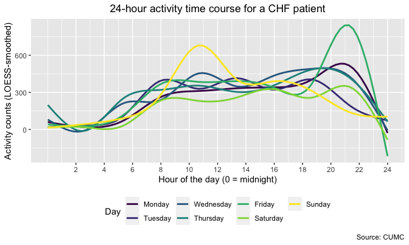
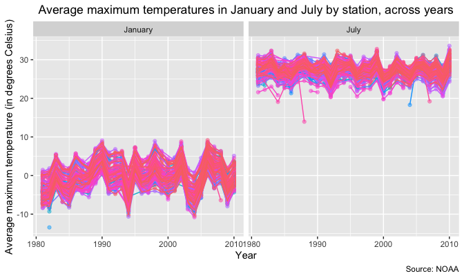

Homework 3
================

## Problem 1

``` r
library(p8105.datasets)
data("instacart")

head(instacart, 5)
```

    ## # A tibble: 5 × 15
    ##   order_id product_id add_to_c…¹ reord…² user_id eval_…³ order…⁴ order…⁵ order…⁶
    ##      <int>      <int>      <int>   <int>   <int> <chr>     <int>   <int>   <int>
    ## 1        1      49302          1       1  112108 train         4       4      10
    ## 2        1      11109          2       1  112108 train         4       4      10
    ## 3        1      10246          3       0  112108 train         4       4      10
    ## 4        1      49683          4       0  112108 train         4       4      10
    ## 5        1      43633          5       1  112108 train         4       4      10
    ## # … with 6 more variables: days_since_prior_order <int>, product_name <chr>,
    ## #   aisle_id <int>, department_id <int>, aisle <chr>, department <chr>, and
    ## #   abbreviated variable names ¹​add_to_cart_order, ²​reordered, ³​eval_set,
    ## #   ⁴​order_number, ⁵​order_dow, ⁶​order_hour_of_day

The `instacart` dataset contains 1384617 rows and 15 columns, such as
`order_id`, `product_id`, `user_id`, `order_number`, and `product_name`.

``` r
insta_orders = instacart %>%
  mutate(aisle = as.factor(aisle)) %>%
  group_by(aisle) %>%
  summarise(order_count = n_distinct(order_id)) %>%
  arrange(desc(order_count))

head(insta_orders, 5)
```

    ## # A tibble: 5 × 2
    ##   aisle                      order_count
    ##   <fct>                            <int>
    ## 1 fresh fruits                     72178
    ## 2 fresh vegetables                 59172
    ## 3 packaged vegetables fruits       50257
    ## 4 yogurt                           33249
    ## 5 packaged cheese                  31199

There are 134 distinct aisles; `fresh fruits` and `fresh vegetables` are
the aisles with the highest order counts.

``` r
insta_orders %>%
  filter(order_count > 10000) %>%
  mutate(aisle = fct_reorder(aisle, order_count, .desc = TRUE)) %>%
  ggplot(aes(x = aisle, y = order_count)) +
  geom_point() +
  labs(
    title = "Order counts by aisle",
    x = "Aisle",
    y = "Number of orders",
    caption = "Source: Instacart"
  ) +
  theme(plot.title = element_text(hjust = .5),
        axis.text.x = element_text(angle = 45, hjust = 1))
```


`paper goods` and `canned jarred vegetables` are the least popular
aisles.

``` r
instacart %>%
  filter(aisle %in% c("baking ingredients", "dog food care", "packaged vegetables fruits")) %>%
  mutate(product_name = as.factor(product_name)) %>%
  group_by(aisle, product_name) %>%
  summarise(order_count = n_distinct(order_id)) %>%
  mutate(rank = min_rank(desc(order_count))) %>%
  filter(rank < 4) %>%
  arrange(aisle, rank) %>%
  select(-rank) %>%
  knitr::kable()
```

| aisle                      | product_name                                  | order_count |
|:---------------------------|:----------------------------------------------|------------:|
| baking ingredients         | Light Brown Sugar                             |         499 |
| baking ingredients         | Pure Baking Soda                              |         387 |
| baking ingredients         | Cane Sugar                                    |         336 |
| dog food care              | Snack Sticks Chicken & Rice Recipe Dog Treats |          30 |
| dog food care              | Organix Chicken & Brown Rice Recipe           |          28 |
| dog food care              | Small Dog Biscuits                            |          26 |
| packaged vegetables fruits | Organic Baby Spinach                          |        9784 |
| packaged vegetables fruits | Organic Raspberries                           |        5546 |
| packaged vegetables fruits | Organic Blueberries                           |        4966 |

The most popular item in `packaged vegetables fruits` is
`Organic Baby Spinach`.

``` r
instacart %>%
  filter(product_name %in% c("Pink Lady Apples", "Coffee Ice Cream")) %>%
  group_by(product_name, order_dow) %>%
  summarise(mean_hr = mean(order_hour_of_day)) %>%
  pivot_wider(names_from = product_name,
              values_from = mean_hr) %>%
  knitr::kable(digits = 1)
```

| order_dow | Coffee Ice Cream | Pink Lady Apples |
|----------:|-----------------:|-----------------:|
|         0 |             13.8 |             13.4 |
|         1 |             14.3 |             11.4 |
|         2 |             15.4 |             11.7 |
|         3 |             15.3 |             14.2 |
|         4 |             15.2 |             11.6 |
|         5 |             12.3 |             12.8 |
|         6 |             13.8 |             11.9 |

On average, Coffee Ice Cream orders tend to be placed after noon and
before 4pm, whereas Pink Lady Apples orders tend to be placed between
11am and 3pm.

## Problem 2

``` r
accel_long = read_csv(file = "data/accel_data.csv") %>%
  janitor::clean_names() %>%
  mutate(day = factor(day, c("Monday", "Tuesday", "Wednesday", "Thursday", "Friday", "Saturday", "Sunday"))) %>%
  pivot_longer(activity_1:activity_1440,
               names_to = "minute",
               names_prefix = "activity_",
               values_to = "activity_meas_minute") %>%
  mutate(day_type = ifelse(day == "Saturday" | day == "Sunday", "Weekend", "Weekday"),
         day_type = factor(day_type),
         minute = as.numeric(minute)) %>%
  arrange(week, day_id, day, minute)

head(accel_long, 10)
```

    ## # A tibble: 10 × 6
    ##     week day_id day    minute activity_meas_minute day_type
    ##    <dbl>  <dbl> <fct>   <dbl>                <dbl> <fct>   
    ##  1     1      1 Friday      1                 88.4 Weekday 
    ##  2     1      1 Friday      2                 82.2 Weekday 
    ##  3     1      1 Friday      3                 64.4 Weekday 
    ##  4     1      1 Friday      4                 70.0 Weekday 
    ##  5     1      1 Friday      5                 75.0 Weekday 
    ##  6     1      1 Friday      6                 66.3 Weekday 
    ##  7     1      1 Friday      7                 53.8 Weekday 
    ##  8     1      1 Friday      8                 47.8 Weekday 
    ##  9     1      1 Friday      9                 55.5 Weekday 
    ## 10     1      1 Friday     10                 43.0 Weekday

We import and tidy the dataset (i.e. `accel_long`) by setting `day` as a
factor variable, pivoting the `activity_*` variables to long format,
adding a `day_type` variable to distinguish weekdays and weekend days
from one another, and defining `minute` as a numeric variable, among
other cleaning steps. The resulting dataset contains 50400 rows and 6
fields, i.e. temporal variables (e.g. `week`, `day`, `minute`, and
`day_type`) and activity counts by minute, as denoted by
`activity_meas_minute`.

``` r
accel_long %>%
  group_by(week, day) %>%
  summarise(activity_meas_day = sum(activity_meas_minute)) %>%
  pivot_wider(names_from = day,
              values_from = activity_meas_day) %>%
  janitor::adorn_totals() %>%
  knitr::kable()
```

| week  |     Monday |   Tuesday | Wednesday |  Thursday |    Friday | Saturday |  Sunday |
|:------|-----------:|----------:|----------:|----------:|----------:|---------:|--------:|
| 1     |   78828.07 |  307094.2 |    340115 |  355923.6 |  480542.6 |   376254 |  631105 |
| 2     |  295431.00 |  423245.0 |    440962 |  474048.0 |  568839.0 |   607175 |  422018 |
| 3     |  685910.00 |  381507.0 |    468869 |  371230.0 |  467420.0 |   382928 |  467052 |
| 4     |  409450.00 |  319568.0 |    434460 |  340291.0 |  154049.0 |     1440 |  260617 |
| 5     |  389080.00 |  367824.0 |    445366 |  549658.0 |  620860.0 |     1440 |  138421 |
| Total | 1858699.07 | 1799238.2 |   2129772 | 2091150.6 | 2291710.6 |  1369237 | 1919213 |

``` r
# note: activity counts for Saturday in weeks 4 and 5 are 1440 each (i.e. number of minutes in a day; may merit further investigation) 
```

Total daily activity counts for the full five-week data collection
period are highest for Wednesday, Thursday, and Friday (2129772,
2091150.6, and 2291710.6, respectively), and lowest for Saturday
(1369237).

``` r
ggplot(accel_long, aes(x = minute, y = activity_meas_minute, color = day)) +
  geom_smooth(se = FALSE, alpha = 1, size = 1) + 
  scale_x_continuous(
  breaks = c(120, 240, 360, 480, 600, 720, 840, 960, 1080, 1200, 1320, 1440),
  labels = c("2", "4", "6", "8", "10", "12", "14", "16", "18", "20", "22", "24")
) +
  labs(
    title = "24-hour activity time course for a CHF patient",
    x = "Hour of the day (0 = midnight)",
    y = "Activity counts (LOESS-smoothed)",
    caption = "Source: CUMC"
  ) +
  viridis::scale_color_viridis(
    name = "Day",
    discrete = TRUE
  ) + theme(legend.position = "bottom",
            plot.title = element_text(hjust = .5))
```



The plot above displays 24-hour (LOESS-smoothed) curves for activity
counts for each day of the week. For the individual in question, average
activity counts appear to fall in or near the 300 to 450 range between
9am and 4pm on weekdays; during the same period of the day, average
activity counts trend below this range on Saturdays and exceed this
range substantially on Sundays, with the Sunday average peaking above
600 before 11am. The LOESS-smoothed curve for activity counts on Friday
rises above 450 around 7pm and peaks above 800 around 9pm, similarly
suggesting a period of heightened activity.

## Problem 3

``` r
library(p8105.datasets)
data("ny_noaa")

skimr::skim(ny_noaa)
```

|                                                  |         |
|:-------------------------------------------------|:--------|
| Name                                             | ny_noaa |
| Number of rows                                   | 2595176 |
| Number of columns                                | 7       |
| \_\_\_\_\_\_\_\_\_\_\_\_\_\_\_\_\_\_\_\_\_\_\_   |         |
| Column type frequency:                           |         |
| character                                        | 3       |
| Date                                             | 1       |
| numeric                                          | 3       |
| \_\_\_\_\_\_\_\_\_\_\_\_\_\_\_\_\_\_\_\_\_\_\_\_ |         |
| Group variables                                  | None    |

Data summary

**Variable type: character**

| skim_variable | n_missing | complete_rate | min | max | empty | n_unique | whitespace |
|:--------------|----------:|--------------:|----:|----:|------:|---------:|-----------:|
| id            |         0 |          1.00 |  11 |  11 |     0 |      747 |          0 |
| tmax          |   1134358 |          0.56 |   1 |   4 |     0 |      532 |          0 |
| tmin          |   1134420 |          0.56 |   1 |   4 |     0 |      548 |          0 |

**Variable type: Date**

| skim_variable | n_missing | complete_rate | min        | max        | median     | n_unique |
|:--------------|----------:|--------------:|:-----------|:-----------|:-----------|---------:|
| date          |         0 |             1 | 1981-01-01 | 2010-12-31 | 1997-01-21 |    10957 |

**Variable type: numeric**

| skim_variable | n_missing | complete_rate |  mean |     sd |  p0 | p25 | p50 | p75 |  p100 | hist  |
|:--------------|----------:|--------------:|------:|-------:|----:|----:|----:|----:|------:|:------|
| prcp          |    145838 |          0.94 | 29.82 |  78.18 |   0 |   0 |   0 |  23 | 22860 | ▇▁▁▁▁ |
| snow          |    381221 |          0.85 |  4.99 |  27.22 | -13 |   0 |   0 |   0 | 10160 | ▇▁▁▁▁ |
| snwd          |    591786 |          0.77 | 37.31 | 113.54 |   0 |   0 |   0 |   0 |  9195 | ▇▁▁▁▁ |

We first import and review the `ny_noaa` dataset. The data contains
2595176 rows and 7 fields, including an `id` variable denoting weather
station, a `date` variable for the observation date, and several weather
measures (e.g. `snow` for snowfall, `tmax` for maximum temperature, and
`tmin` for minimum temperature). There are no missing values on `id` or
`date`. `tmax` and `tmin` each contain data on only 56 percent of
observations, while the `snwd`, `snow`, and `prcp` variables exhibit
higher rates of data completeness (77 percent, 85 percent, and 94
percent, respectively).

``` r
noaa_clean = ny_noaa %>%
  separate(date, into = c("year", "month", "day"), sep = "-", convert = TRUE) %>%
  mutate(tmax_c = as.integer(tmax) / 10, # convert tenths of C to C
         tmin_c = as.integer(tmin) / 10, # convert tenths of C to C
         prcp_cm = prcp / 100, # convert tenths of mm to cm
         snow_cm = snow / 10, # convert mm to cm 
         snwd_cm = snwd / 10) %>% # convert mm to cm 
  rename(snow_mm = snow) %>%
  select(-c(5, 7:9)) %>%
  relocate(snow_mm, .after = prcp_cm)

head(noaa_clean, 10)
```

    ## # A tibble: 10 × 10
    ##    id           year month   day tmax_c tmin_c prcp_cm snow_mm snow_cm snwd_cm
    ##    <chr>       <int> <int> <int>  <dbl>  <dbl>   <dbl>   <int>   <dbl>   <dbl>
    ##  1 US1NYAB0001  2007    11     1     NA     NA      NA      NA      NA      NA
    ##  2 US1NYAB0001  2007    11     2     NA     NA      NA      NA      NA      NA
    ##  3 US1NYAB0001  2007    11     3     NA     NA      NA      NA      NA      NA
    ##  4 US1NYAB0001  2007    11     4     NA     NA      NA      NA      NA      NA
    ##  5 US1NYAB0001  2007    11     5     NA     NA      NA      NA      NA      NA
    ##  6 US1NYAB0001  2007    11     6     NA     NA      NA      NA      NA      NA
    ##  7 US1NYAB0001  2007    11     7     NA     NA      NA      NA      NA      NA
    ##  8 US1NYAB0001  2007    11     8     NA     NA      NA      NA      NA      NA
    ##  9 US1NYAB0001  2007    11     9     NA     NA      NA      NA      NA      NA
    ## 10 US1NYAB0001  2007    11    10     NA     NA      NA      NA      NA      NA

We proceed to tidy the data by disaggregating `date` into `year`,
`month`, and `day` variables; converting units on `tmax` and `tmin` to
degrees Celsius; converting units on `prcp`, `snow`, and `snwd` to
centimeters; and relabeling variables as necessary, among other cleaning
steps.

``` r
noaa_clean %>%
  group_by(snow_mm) %>%
  summarise(values_count = n()) %>%
  arrange(desc(values_count)) %>%
  head(5)
```

    ## # A tibble: 5 × 2
    ##   snow_mm values_count
    ##     <int>        <int>
    ## 1       0      2008508
    ## 2      NA       381221
    ## 3      25        31022
    ## 4      13        23095
    ## 5      51        18274

``` r
noaa_clean %>%
  group_by(month) %>%
  summarise(mean_snow_mm = mean(snow_mm, na.rm = TRUE))
```

    ## # A tibble: 12 × 2
    ##    month mean_snow_mm
    ##    <int>        <dbl>
    ##  1     1    16.9     
    ##  2     2    14.4     
    ##  3     3     9.24    
    ##  4     4     2.48    
    ##  5     5     0.0791  
    ##  6     6     0.00160 
    ##  7     7     0.000441
    ##  8     8     0.00182 
    ##  9     9     0.00195 
    ## 10    10     0.402   
    ## 11    11     4.27    
    ## 12    12    14.7

`0` is the most commonly observed value on `snow_mm` (i.e. the original
variable `snow`, renamed), recorded in 2008508 observations, as there is
minimal snowfall observed during certain months of the year; in fact,
average snowfall (in millimeters) is 0.002 or less in June, July,
August, and September. `NA` is the second most commonly observed value
on `snow_mm`, recorded in 381221 observations, likely due to stations
not collecting data on snowfall (among other fields), as noted in the
available documentation for the NOAA dataset.

``` r
noaa_clean %>%
  filter(month %in% c(1, 7)) %>%
  mutate(month = ifelse(test = month == 1, "January", "July")) %>%
  group_by(id, year, month) %>% 
  summarise(tmax_avg = mean(tmax_c)) %>%
  ggplot(aes(x = year, y = tmax_avg, color = id)) +
  geom_point(alpha = .5) +
  geom_line() +
  facet_grid(~month) +
  labs(
    title = "Average maximum temperatures in January and July, across years and by station",
    x = "Year",
    y = "Average maximum temperature (in degrees Celsius)",
    caption = "Source: NOAA"
  ) +
  viridis::scale_fill_viridis(discrete = TRUE) +
  theme(legend.position = "none",
            plot.title = element_text(hjust = .5))
```



Average maximum temperatures by station in January, as shown in the
above plot, have tended to fall within the -10 to 10 degrees Celsius
range across years, with some outliers below -10 degrees Celsius
recorded in the early 1980s, the mid-1990s, and the mid-aughts. Average
maximum temperatures by station in July have tended to fall within the
20 to 35 degrees Celsius range across years, with a handful of outliers
below 20 degrees Celsius recorded in the 1980s and the aughts. The
highest average maximum temperature in July for any station appears to
have been recorded in 2010.

``` r
tmax_v_tmin = noaa_clean %>%
  ggplot(aes(x = tmin_c, y = tmax_c)) +
  geom_hex(size = .5) +
  labs(
    title = "Average maximum temperatures vs. average minimum temperatures",
    x = "Average minimum temperature (in degrees Celsius)",
    y = "Average maximum temperature (in degrees Celsius)",
    caption = "Source: NOAA"
  ) +
    theme(plot.title = element_text(hjust = .5))

snow_dist = noaa_clean %>%
  filter(snow_mm > 0 & snow_mm < 100) %>%
  mutate(year = as.factor(year)) %>%
  ggplot(aes(x = snow_mm, y = year)) +
  geom_density_ridges(scale = .8) +
  labs(
    title = "Distributions of snowfalls above 0 millimeters and below 100 millimeters, by year",
    x = "Snowfall (in millimeters)",
    y = "Year",
    caption = "Source: NOAA"
  ) +
    theme(plot.title = element_text(hjust = .5))
# note: uses original units on snow, per 10/12 instruction
  
tmax_v_tmin / snow_dist
```


The first panel (i.e. hexagonal heatmap) appears to show a positive
relationship between average minimum temperatures and average maximum
temperatures by station. The second panel (i.e. ridge plot) suggests
some consistency in overall distribution patterns for snowfall across
years, albeit with less pronounced concentrations of snowfalls above 40
millimeters in the latter years.
